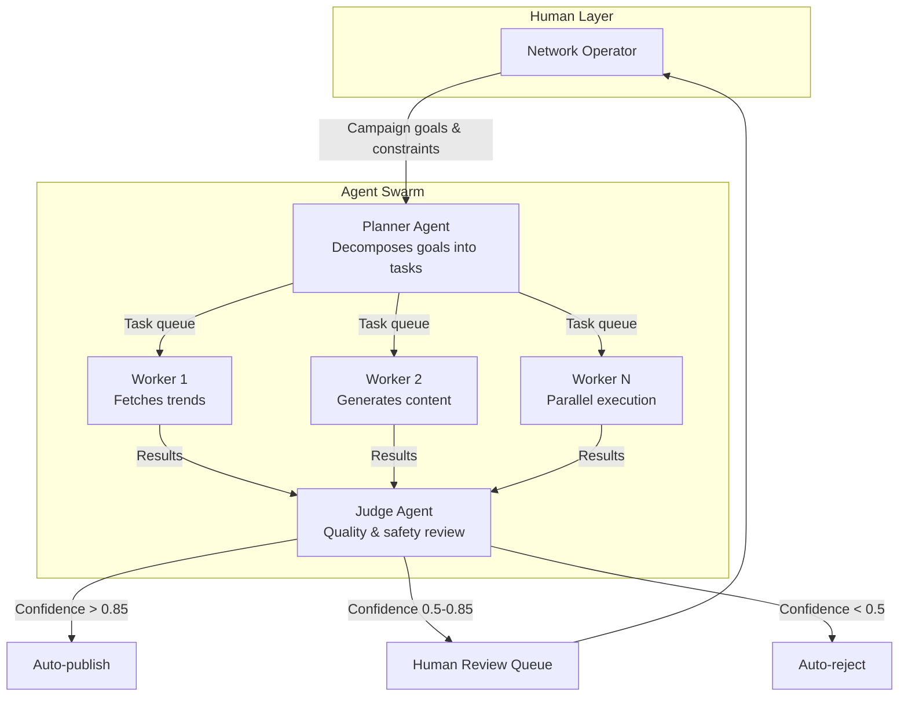

# Chimera Agentic Infrastructure

[](https://github.com/Zerubabel-J/chimera-agentic-infra/actions)
[](https://opensource.org/licenses/MIT)
[](https://www.python.org/downloads/)

> Infrastructure foundation for **Project Chimera** - an Autonomous Influencer Network that uses AI agent swarms to research trends, generate content, and manage social media engagement with human-in-the-loop safety.

---

## 🎯 What Is This?

This is NOT an AI influencer (yet). This is the **factory that builds AI influencers.**

Following Spec-Driven Development (SDD) principles, this repository provides:
- ✅ Complete specifications for autonomous agent behavior
- ✅ Failing tests that define success criteria (TDD)
- ✅ Agent skill interfaces (fetch trends, generate content, evaluate quality)
- ✅ CI/CD pipeline with AI code review
- ✅ Docker containerization for reproducible environments
- ✅ MCP (Model Context Protocol) integration for external tools

**Status:** Infrastructure phase complete. Ready for implementation.

---

## 🏗️ Architecture

### Hierarchical Swarm Pattern



### Technology Stack

| Layer | Technology | Purpose |
|-------|------------|---------|
| **Language** | Python 3.11+ | Agent logic, async I/O |
| **Validation** | Pydantic v2 | Strict data contracts |
| **Vector DB** | Weaviate | Agent memory, semantic search |
| **Cache/Queue** | Redis | Short-term memory, task queue |
| **Database** | PostgreSQL | User accounts, campaigns, logs |
| **Protocol** | MCP (Model Context Protocol) | Universal tool interface |
| **CI/CD** | GitHub Actions | Automated testing & deployment |
| **Containers** | Docker | Environment reproducibility |

---

## 📁 Repository Structure

```
chimera-agentic-infra/
├── specs/                      # 📋 Source of truth
│   ├── _meta.md               # Vision, constraints, scope
│   ├── functional.md          # User stories (FR-A01, FR-J01, etc.)
│   ├── technical.md           # API contracts, database schema
│   ├── frontend.md            # Review UI specification
│   └── openclaw_integration.md # Agent social network plan
│
├── skills/                     # 🛠️ Agent capabilities
│   ├── fetch_trends/          # Trend research skill
│   ├── generate_content/      # Content generation skill
│   └── evaluate_content/      # Judge review skill
│
├── tests/                      # ✅ TDD contracts
│   ├── test_trend_fetcher.py  # Validates TrendResult shape
│   └── test_skills_interface.py # Validates skill structure
│
├── research/                   # 📝 Architecture decisions
│   ├── architecture_strategy.md
│   ├── research_notes.md
│   └── tooling_strategy.md
│
├── .mcp/                       # 🔌 MCP server configs
│   ├── servers.json           # Server definitions
│   └── README.md              # Setup instructions
│
├── .github/workflows/          # 🤖 CI/CD pipelines
│   └── main.yml               # Lint → Spec-check → Test
│
├── CLAUDE.md                   # 🧠 AI assistant rules
├── Dockerfile                  # 🐳 Container definition
├── Makefile                    # 🔧 Command shortcuts
└── .coderabbit.yaml           # 🦝 AI code review config
```

---

## 🚀 Quick Start

### Prerequisites
- Python 3.11+
- [uv](https://github.com/astral-sh/uv) package manager
- Docker (optional, for containerized testing)

### Installation

```bash
# Clone the repository
git clone https://github.com/Zerubabel-J/chimera-agentic-infra.git
cd chimera-agentic-infra

# Create virtual environment and install dependencies
make setup

# Verify installation
make spec-check
make lint
```

### Running Tests (TDD)

```bash
# Run all tests (21 expected to fail - that's correct!)
make test

# Run tests in Docker
make docker-test
```

**Why do tests fail?** This is **Test-Driven Development**. The tests define the contracts that code must satisfy. They're written BEFORE implementation. When all 24 tests pass, the system is complete.

### MCP Setup

```bash
# Copy environment template
cp .env.example .env

# Edit .env with your API keys
nano .env

# Verify MCP configuration
cat .mcp/servers.json
```

See [.mcp/README.md](.mcp/README.md) for detailed MCP setup instructions.

---

## 📖 Specification-Driven Development

This project follows **Spec-Driven Development (SDD)**:

```
Business Need → specs/_meta.md (vision)
                      ↓
             specs/functional.md (user stories)
                      ↓
             specs/technical.md (contracts)
                      ↓
                  tests/ (verification)
                      ↓
              Implementation (code)
```

### Key Principles

1. **Specs are the source of truth** - All code references a spec
2. **Tests before code** - TDD ensures contracts are met
3. **Traceability** - Every feature traces back to a business need
4. **AI-friendly** - Precise specs prevent AI hallucination

---

## 🧪 Testing Philosophy

### Current Test Status

```bash
$ make test

24 tests collected
3 PASSED  ✅ (skills are importable)
21 FAILED ❌ (models.py and service.py don't exist yet)
```

This is **intentional and correct**. The failing tests are:
- Contracts for future implementations
- Acceptance criteria from specs
- Empty slots that AI agents (or developers) must fill

When all tests pass, the system is complete.

---

## 🤝 Contributing

This is an educational/challenge project. Contributions welcome!

### Development Workflow

1. Read the relevant spec in `specs/`
2. Check `CLAUDE.md` for coding guidelines
3. Write/update tests first (TDD)
4. Implement the feature
5. Run `make lint && make test`
6. Commit with descriptive message

### Commit Message Format

```
feat: add user authentication to campaign dashboard
fix: resolve race condition in Judge agent
docs: update MCP server setup instructions
test: add acceptance criteria for FR-A02
```

---

## 📊 Project Status

| Component | Status |
|-----------|--------|
| Specifications | ✅ Complete |
| Skills (structure) | ✅ Complete |
| Tests (TDD) | ✅ Complete (21 failing as expected) |
| CI/CD | ✅ Complete |
| Docker | ✅ Complete |
| MCP Config | ✅ Complete |
| Implementation | ⏳ Pending (future work) |

---

## 📚 Documentation

- [Architecture Strategy](research/architecture_strategy.md) - Why we chose Hierarchical Swarm
- [Tooling Strategy](research/tooling_strategy.md) - MCP Servers vs Agent Skills
- [Research Notes](research/research_notes.md) - Insights from industry research
- [Frontend Spec](specs/frontend.md) - Human review interface design
- [Technical Spec](specs/technical.md) - Complete API contracts

---

## 🎥 Video Walkthrough

> [Link to Loom video walkthrough](https://your-loom-link-here)

Covers:
- Spec structure explanation
- OpenClaw integration plan
- Running failing tests (TDD proof)
- AI assistant context demonstration

---

## 📄 License

MIT License - see [LICENSE](LICENSE) file for details.

---

## 🙏 Acknowledgments

- Challenge framework: [AiQEM.tech](https://aiqem.tech)
- MCP Protocol: [Anthropic](https://github.com/anthropics/mcp)
- FastRender Pattern: Inspired by browser automation research
- Agent Social Networks: OpenClaw / MoltBook ecosystem

---

**Built with ❤️ as part of the Forward Deployed Engineer (FDE) Trainee Challenge**
