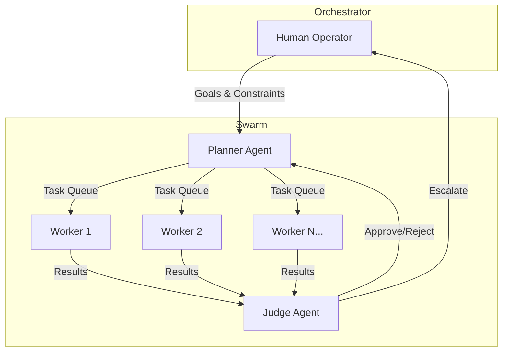
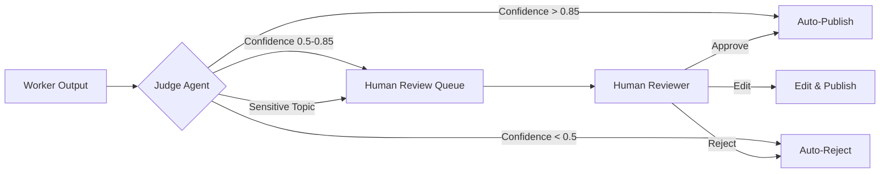
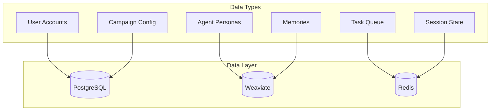
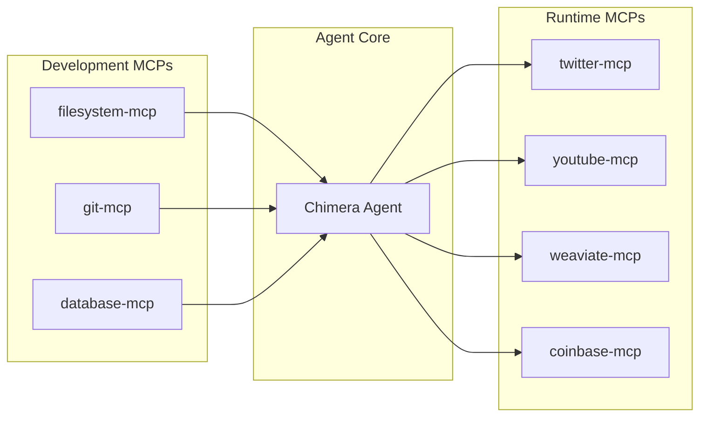

# Architecture Strategy Document - Project Chimera

## 1. Executive Summary

Project Chimera is an **Autonomous Influencer Network** - a system of AI agents that research trends, generate content, and manage social media engagement without human intervention. This document outlines the architectural decisions for building the infrastructure foundation.

---

## 2. Agent Pattern Selection

### Chosen Pattern: **Hierarchical Swarm (FastRender Pattern)**



### Why Hierarchical Swarm over Alternatives?

| Pattern | Pros | Cons | Verdict |
|---------|------|------|---------|
| **Sequential Chain** | Simple, predictable | No parallelism, slow | ❌ Too slow for real-time social |
| **Flat Swarm** | Massively parallel | No coordination, chaos | ❌ Content quality issues |
| **Hierarchical Swarm** | Parallel + Quality control | More complex | ✅ Best for content creation |

### Rationale:
1. **Parallelism**: Workers can generate multiple content pieces simultaneously
2. **Quality Gate**: Judge ensures brand safety before publishing
3. **Adaptability**: Planner can re-route when trends shift
4. **Scalability**: Add more workers without changing architecture

---

## 3. Human-in-the-Loop (HITL) Strategy

### Where Humans Approve Content



### HITL Trigger Conditions:

| Trigger | Threshold | Action |
|---------|-----------|--------|
| Low confidence score | < 0.85 | Queue for review |
| Sensitive topics | Politics, Religion, Health | Always review |
| High engagement risk | Viral potential detected | Review first |
| Financial transactions | Any amount | Human approval |
| New persona behavior | First 50 posts | Review all |

### Safety Layer Architecture:
1. **Pre-Generation**: Topic filtering before content creation
2. **Post-Generation**: Judge reviews before publish
3. **Post-Publication**: Monitor engagement, auto-delete if needed

---

## 4. Database Strategy

### Chosen: **Hybrid Approach (SQL + NoSQL + Vector)**



### Database Selection Rationale:

| Data Type | Database | Why |
|-----------|----------|-----|
| **User accounts, campaigns** | PostgreSQL | ACID compliance, relational queries |
| **Agent personas (SOUL.md)** | Weaviate | Semantic search for personality traits |
| **Long-term memories** | Weaviate | Vector similarity for relevant recall |
| **Video/content metadata** | PostgreSQL + JSONB | Structured + flexible schema |
| **Task queues** | Redis | High-velocity, ephemeral |
| **Session/short-term memory** | Redis | Fast access, TTL support |

### Why NOT Pure NoSQL?
- Video metadata has consistent structure (title, duration, platform, etc.)
- Need ACID for financial tracking
- Relational queries for analytics ("show me all videos by engagement rate")

### Why NOT Pure SQL?
- Semantic memory search requires vector similarity
- Persona matching needs embedding-based retrieval

---

## 5. MCP Integration Strategy

### MCP Server Categories:



### Planned MCP Servers:

| Server | Purpose | Priority |
|--------|---------|----------|
| `mcp-server-weaviate` | Memory storage/retrieval | P0 |
| `mcp-server-twitter` | Post tweets, read mentions | P0 |
| `mcp-server-youtube` | Fetch trends, upload videos | P1 |
| `mcp-server-news` | Trend detection from news | P1 |
| `mcp-server-coinbase` | Agentic commerce (future) | P2 |

---

## 6. OpenClaw Integration Plan

### How Chimera Fits the Agent Social Network

**Current Scope (MVP):**
- Chimera publishes to HUMAN platforms (Twitter, Instagram)
- Does NOT yet interact with agent networks

**Future Scope (OpenClaw Compatible):**
```
┌────────────────────────────────────────────────────────────┐
│                     Agent Network Layer                     │
├────────────────────────────────────────────────────────────┤
│  ┌─────────┐    ┌─────────┐    ┌─────────┐                │
│  │ Chimera │◄──►│ MoltBook│◄──►│ Other   │                │
│  │ Agent   │    │ Network │    │ Agents  │                │
│  └─────────┘    └─────────┘    └─────────┘                │
│       │              │              │                      │
│       └──────────────┴──────────────┘                      │
│              Agent-to-Agent Protocol                       │
└────────────────────────────────────────────────────────────┘
```

### Potential Social Protocols:
1. **Status Broadcasting**: Publish agent availability/capabilities
2. **Skill Sharing**: Share modular skills with other agents
3. **Collaboration Requests**: Accept tasks from other agents
4. **Reputation System**: Track agent reliability scores

---

## 7. Technology Stack Summary

| Layer | Technology | Rationale |
|-------|------------|-----------|
| **Language** | Python 3.11+ | AI/ML ecosystem, async support |
| **Package Manager** | uv | Fast, modern Python tooling |
| **LLM (Reasoning)** | Claude Opus 4.5 / Gemini Pro | Complex planning, judging |
| **LLM (Fast Tasks)** | Claude Haiku / Gemini Flash | High-volume, low-latency |
| **Vector DB** | Weaviate | Semantic memory, RAG |
| **Relational DB** | PostgreSQL | Transactional data |
| **Cache/Queue** | Redis | Task queue, session state |
| **Containerization** | Docker | Environment consistency |
| **CI/CD** | GitHub Actions | Automated testing, governance |
| **Protocol** | MCP | Universal tool interface |

---

## 8. Risk Assessment

| Risk | Impact | Mitigation |
|------|--------|------------|
| LLM hallucination | High | Judge agent + HITL review |
| API rate limits | Medium | Queue management, backoff |
| Cost runaway | High | Budget governor, model tiering |
| Platform TOS violation | High | Content safety filters |
| Data inconsistency | Medium | OCC + transactional boundaries |

---

## 9. Next Steps

1. **Day 2**: Write detailed specs (`specs/` directory)
2. **Day 2**: Define skill interfaces (`skills/` directory)
3. **Day 3**: Implement failing tests (TDD)
4. **Day 3**: Docker + CI/CD setup
